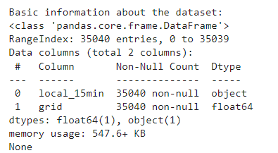

# A. Time Series Data Plotting

This project visualizes a subset of time series data using Python's `matplotlib` library. The plot displays grid values over a selected range of timestamps.

## Features
- Plots a time series with a specified range of rows.
- Adds titles, labels, and a grid for better readability.
- Rotates x-axis labels for improved visibility.

## Requirements
To run the script, you need the following:
- Python 3.7 or higher
- Installed Python libraries:
  - `matplotlib`
  - `pandas` (to handle the dataset)

## Step 1: Install the required libraries using:
```bash
pip install matplotlib pandas
```
## Step 2: Run below snippet:
```bash
# Import the required library
import matplotlib.pyplot as plt

# Slice the desired range (100th to 200th rows)
subset = data.iloc[50:150]

# Plot the time series
plt.figure(figsize=(12, 6))
plt.plot(subset.index, subset['grid'], label='Grid Value')
plt.title('Time Series Plot (Timestamps on X-Axis)')
plt.xlabel('Timestamp')
plt.ylabel('Grid Value')
plt.xticks(rotation=90)  # Rotate x-axis labels for better visibility
plt.legend()
plt.grid()

# Save the plot as an image file
plt.savefig('plot.png')  # Save the plot to the project folder
plt.show()
```


## Description of the Plot
### Title: Time Series Plot (Grid VS Time)"

Y-Axis (Vertical Axis): Represents the Grid Value, which seems to be a numerical metric.
The values range from -1.00 to 0.75, suggesting fluctuations in the data.
X-Axis (Horizontal Axis): Represents Time, with timestamps ranging from 01-01-18 12:30 to 01-01-18 19:45.
The timestamps are in the format MM-DD-YY HH:MM, indicating the data is recorded at 15-minute intervals.
Data Points: The plot likely shows a line graph or scatter plot connecting the Grid Value over time.
The values fluctuate between -1.00 and 0.75, suggesting variability in the data.

# Display basic information about the dataset
## We can get a report on the basic information of the Dataset that we are working with
```bash
print("\nBasic information about the dataset:")
print(data.info())
```

