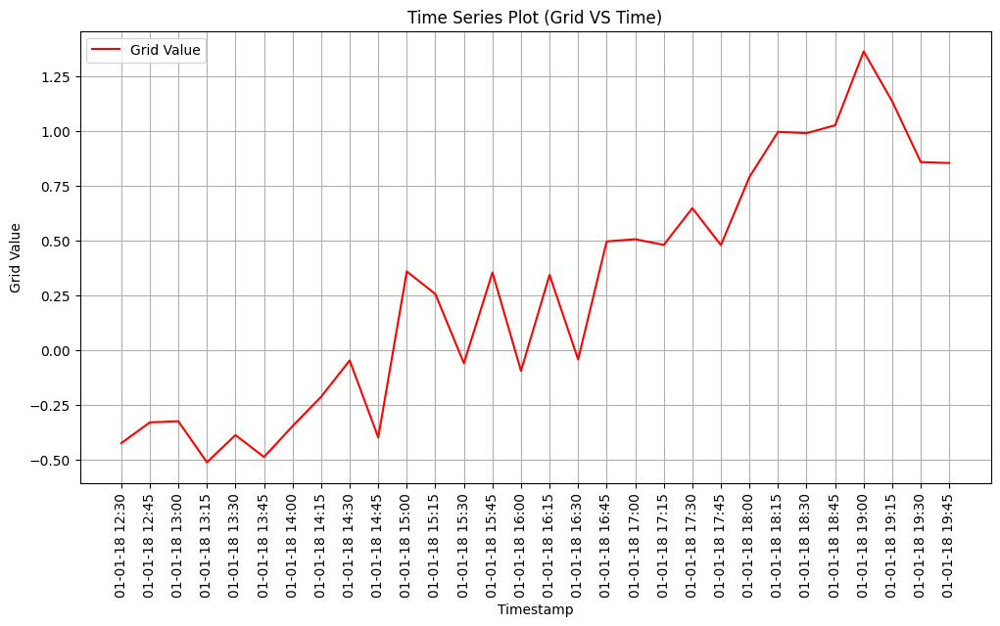

# Time Series Data Plotting

This project visualizes a subset of time series data using Python's `matplotlib` library. The plot displays grid values over a selected range of timestamps.

## Features
- Plots a time series with a specified range of rows.
- Adds titles, labels, and a grid for better readability.
- Rotates x-axis labels for improved visibility.

## Requirements
To run the script, you need the following:
- Python 3.7 or higher
- Installed Python libraries:
  - `matplotlib`
  - `pandas` (to handle the dataset)

Install the required libraries using:
```bash
pip install matplotlib pandas

# Import the required library
import matplotlib.pyplot as plt

# Slice the desired range (100th to 200th rows)
subset = data.iloc[50:150]

# Plot the time series
plt.figure(figsize=(12, 6))
plt.plot(subset.index, subset['grid'], label='Grid Value')
plt.title('Time Series Plot (Timestamps on X-Axis)')
plt.xlabel('Timestamp')
plt.ylabel('Grid Value')
plt.xticks(rotation=90)  # Rotate x-axis labels for better visibility
plt.legend()
plt.grid()


# Save the plot as an image file
plt.savefig('plot.png')  # Save the plot to the project folder
plt.show()


```markdown

