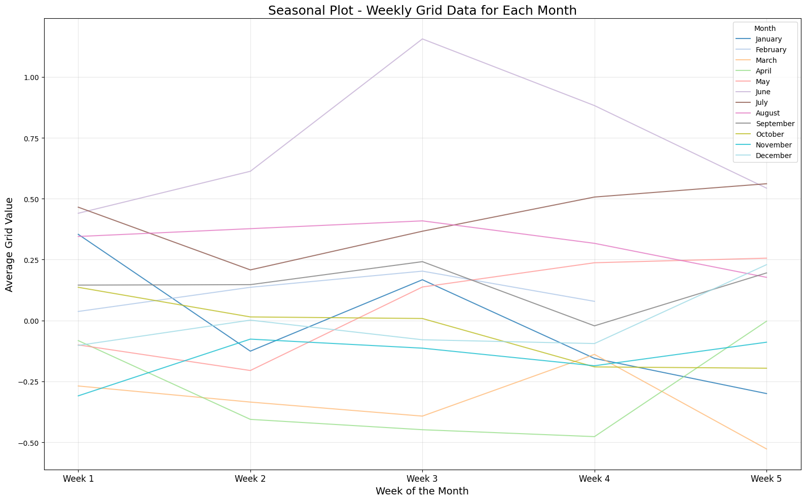
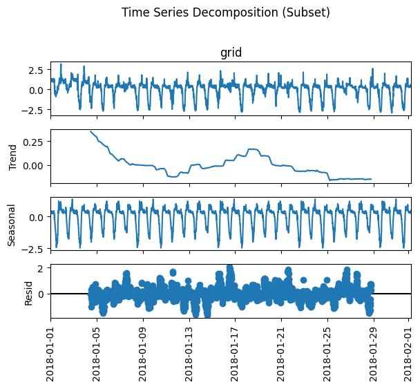

# A. Time Series Data Plotting
We can get visualization a subset of time series data using Python's `matplotlib` library. The plot displays grid values over a selected range of timestamps.

## Features
- Plots a time series with a specified range of rows.
- Adds titles, labels, and a grid for better readability.
- Rotates x-axis labels for improved visibility.

## Requirements
To run the script, you need the following:
- Python 3.7 or higher
- Installed Python libraries:
  - `matplotlib`
  - `pandas` (to handle the dataset)

## Step 1: Install the required libraries using:
```bash
pip install matplotlib pandas
```
## Step 2: Run below snippet:
```bash
# Import the required library
import matplotlib.pyplot as plt

# Slice the desired range (100th to 200th rows)
subset = data.iloc[50:150]

# Plot the time series
plt.figure(figsize=(12, 6))
plt.plot(subset.index, subset['grid'], label='Grid Value')
plt.title('Time Series Plot (Timestamps on X-Axis)')
plt.xlabel('Timestamp')
plt.ylabel('Grid Value')
plt.xticks(rotation=90)  # Rotate x-axis labels for better visibility
plt.legend()
plt.grid()

# Save the plot as an image file
plt.savefig('plot.png')  # Save the plot to the project folder
plt.show()
```


## Description of the Plot
### Title: Time Series Plot (Grid VS Time)"
Y-Axis (Vertical Axis): Represents the Grid Value, which seems to be a numerical metric.
The values range from -1.00 to 0.75, suggesting fluctuations in the data.
X-Axis (Horizontal Axis): Represents Time, with timestamps ranging from 01-01-18 12:30 to 01-01-18 19:45.
The timestamps are in the format MM-DD-YY HH:MM, indicating the data is recorded at 15-minute intervals.
Data Points: The plot likely shows a line graph or scatter plot connecting the Grid Value over time.
The values fluctuate between -1.00 and 0.75, suggesting variability in the data.

# B. Display basic information about the dataset
## We can get a report on the basic information of the Dataset that we are working with
```bash
print("\nBasic information about the dataset:")
print(data.info())
```


## Dataset Overview
DataFrame Class: The dataset is stored as a Pandas DataFrame (<class 'pandas.core.frame.DataFrame'>).
Number of Entries: The dataset contains 35,040 rows (entries), indexed from 0 to 35,039.
Number of Columns: There are 2 columns in the dataset.

# C. Summary Statistics
## We can obtain statistical summary from the Dataset
```bash
print("\nSummary statistics of the dataset:")
print(data.describe())
```


## Summary Statistics Explained
Count: Value: 35,040.000000
This indicates the total number of non-null entries in the grid column. Since it matches the total number of rows in the dataset (as seen in the info.png file), there are no missing values in this column.
1. Mean:
Value: 0.078473
The average value of the grid column is approximately 0.078. This suggests that, on average, the grid values are slightly positive.
2. Standard Deviation (std):
Value: 1.052143
The standard deviation measures the spread or variability of the data. A value of 1.052 indicates that the grid values are relatively spread out around the mean.
3. Minimum (min):
Value: -3.626000
The smallest value in the grid column is -3.626. This indicates that the data includes some significantly negative values.
25th Percentile (25%):
4. Value: -0.234250
Also known as the first quartile, this value indicates that 25% of the data points are less than or equal to -0.234.
5. Median (50%):
Value: 0.247000
The median is the middle value of the dataset. Here, it is 0.247, meaning that 50% of the data points are less than or equal to this value.
6. 75th Percentile (75%):
Value: 0.492000
Also known as the third quartile, this value indicates that 75% of the data points are less than or equal to 0.492.
7. Maximum (max):
Value: 4.063000
The largest value in the grid column is 4.063. This indicates that the data includes some significantly positive values.
### Key Insights
1. Distribution of Data: The grid values range from -3.626 to 4.063, indicating a wide range of variability.
2. The mean (0.078) is close to zero, but the presence of both negative and positive values suggests fluctuations around zero.
3. Skewness: The median (0.247) is higher than the mean (0.078), suggesting that the data might be slightly left-skewed (i.e., there are more extreme negative values pulling the mean down).
4. Spread: The standard deviation (1.052) indicates that the data is moderately spread out. This is further supported by the range between the minimum (-3.626) and maximum (4.063).
5. Quartiles: The interquartile range (IQR = 75th percentile - 25th percentile = 0.492 - (-0.234) = 0.726) shows that the middle 50% of the data is relatively tightly clustered.

# D. Distribution of 'grid' Values
### We can see how the data is distributed. We can do this using Seaborn
#### Step 1. Install Seaborn
#### Step 2. Import Seaborn
1. Install Seaborn
```bash
pip install seaborn
```
2. Run the following code

```bash
import seaborn as sns

# Plot the distribution of 'grid' values
plt.figure(figsize=(12, 6))
sns.histplot(data['grid'], kde=True)
plt.title('Distribution of Grid Values')
plt.xlabel('Grid Value')
plt.ylabel('Frequency')
plt.show()
```


## Distribution Explanation
### Explanation
1. X-Axis (Grid Value): Represents the range of grid values, from -4 to 4.
2. Y-Axis (Frequency): Represents how often each grid value occurs, with frequencies ranging from 0 to 2500.

### Key Observations:
1. The distribution is centered around 0, with most values clustered between -1 and 1.
2. There are fewer extreme values (e.g., near -4 or 4), indicating a relatively tight spread.
3. The shape suggests a normal-like distribution with slight skewness or outliers.

# E. Boxplot
## A boxplot summarizes data distribution, identifies outliers, and compares groups using a five-number summary (min, Q1, median, Q3, max).

```bash
# Plot boxplot to check for outliers in 'grid' values
plt.figure(figsize=(12, 6))
sns.boxplot(x=data['grid'])
plt.title('Boxplot of Grid Values')
plt.xlabel('Grid Value')
plt.show()
```

### The above boxplot explains certain things-
### Observations
1. The median (central line in the box) is close to 0, suggesting the data is centered around this value.
2. The IQR (height of the box) shows the spread of the middle 50% of the data.
3. The whiskers extend to approximately -1 and 2, indicating the range of typical values.
4. There are outliers beyond the whiskers, particularly on the positive side (e.g., near 3 and 4), suggesting extreme values in the dataset.

# F. Plot Autocorrelation
## This graph helps identify patterns or seasonality in time series data.
```bash
from statsmodels.graphics.tsaplots import plot_acf

# Plot autocorrelation
plot_acf(data['grid'].iloc[:1000], lags=100)
plt.show()
```


### Observations
1. The autocorrelation starts high (around 0.75) at smaller lags and gradually decreases as the lag increases.
2. At lag 10, the autocorrelation is around 0.10, indicating a weak relationship.
3. The graph shows no significant negative correlation, as all values remain above -0.25.

# G. Weekly Data Plot for Compapring Each Month
## This graph helps identify monthly patterns or seasonality in time series data.

```bash
import matplotlib.pyplot as plt
import pandas as pd

# Calculate week of the month and extract month/year
data['Week_of_Month'] = (data.index.day - 1) // 7 + 1
data['Month'] = data.index.month

# Group by Month and Week_of_Month, then calculate the mean
weekly_data = data.groupby(['Month', 'Week_of_Month']).mean().reset_index()

# Plot each month's data
plt.figure(figsize=(16, 10))
month_names = ['January', 'February', 'March', 'April', 'May', 'June',
               'July', 'August', 'September', 'October', 'November', 'December']

for i, month in enumerate(month_names, 1):
    monthly_data = weekly_data[weekly_data['Month'] == i]
    plt.plot(monthly_data['Week_of_Month'], monthly_data['grid'], label=month, alpha=0.8)

# Customize the plot
plt.title("Seasonal Plot - Weekly Grid Data for Each Month", fontsize=18)
plt.xlabel("Week of the Month", fontsize=14)
plt.ylabel("Average Grid Value", fontsize=14)
plt.xticks(range(1, 6), labels=["Week 1", "Week 2", "Week 3", "Week 4", "Week 5"], fontsize=12)
plt.grid(alpha=0.3)
plt.legend(title="Month", loc='upper right', fontsize=10)
plt.tight_layout()

plt.show()
```

### Purpose
1. Reveal patterns: Show how grid values (e.g., energy, temperature) change across months and weeks.
2. Compare months: Highlight differences in grid values between months.
3. Detect anomalies: Identify unusual spikes or drops in specific weeks or months.

### Observations
1. Summer months (June, July, August) may show higher values due to air conditioning.
2. Winter months (December, January) may show lower values due to milder weather.
3. A spike in Week 5 could indicate end-of-month activity or billing cycles.
4. An unexpected drop might point to a holiday or external event.

# H. Seasonal Decomposition
## When to use Seasonal Decomposition
1. Identify Trends: Understand long-term increases or decreases in the data.
2. Analyze Seasonality: Detect repeating patterns (e.g., daily, weekly, or yearly cycles).
3. Check Residuals: Look for anomalies or irregularities in the data.

```bash
from statsmodels.tsa.seasonal import seasonal_decompose
import matplotlib.pyplot as plt

# Decompose the time series
decomposition = seasonal_decompose(data['grid'], model='additive', period=96*7)

# Plot the decomposition
decomposition.plot()
plt.suptitle('Time Series Decomposition', y=1.02)  # Add a title
plt.tight_layout()  # Adjust layout
plt.show()
```


### The Time Series Decomposition (Subset) plot breaks down the time series data into three components:
1. Observed (grid): The original data showing fluctuations over time.
2. Trend: The long-term movement in the data, indicating overall increases or decreases.
3. Seasonal: The repeating patterns or cycles within the data.
4. Residual: The remaining noise or irregularities after removing the trend and seasonal components.

### Key Observations:
Trend: Shows a relatively stable pattern with minor fluctuations.
Seasonal: Indicates clear repeating patterns, likely corresponding to daily or weekly cycles.
Residual: Contains noise, but no significant anomalies are visible.
